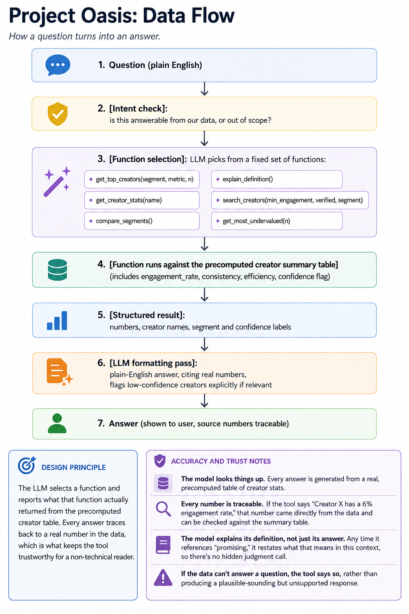

  

# Project Oasis: Creator Partnerships Trending TikTok Analysis

## What this is
A lightweight analysis tool for identifying "promising" creators from a batch of
trending TikTok videos, built for a Head of Creator Partnerships who needs a
fast, trustworthy answer.

## The problem
The dataset has ~1,000 trending videos across ~800 creators, but no follower
count. "Reach" = views. The only status signal is `author_verified`. Raw views
reward one-hit virality and already-famous accounts, which limits their
usefulness for a partnerships strategy.

## Our definition of "promising"
A creator with consistent, above-average engagement across multiple videos,
who isn't yet operating at mega-scale. We exclude one-video outliers and
down-weight verified/high-view accounts, since those are already discovered
and likely more expensive or competitive to sign.

Creators are segmented into:
- **Rising**: strong, consistent engagement, not yet mega-scale. Primary target list.
- **Proven**: strong engagement plus verified or high views. A reach play, but costlier.
- **Breakout**: one viral outlier, inconsistent otherwise. Worth watching, not yet worth betting on.

## Extra signals
- **Efficiency score** (`engagement_rate / views`): surfaces creators getting
  outsized engagement relative to how few people have seen them yet. Powers
  the "Most Undervalued" callout on the summary screen.
- **Confidence flag**: creators are tagged by how many videos their score is
  based on (low confidence at n=1, higher at n>=3), so a single lucky post
  doesn't get mistaken for a pattern.

## What's included
- `analysis.py`: loads CSV, computes engagement rate, consistency, efficiency,
  confidence flag, and segments
- `summary.md` / `summary.html`: the one-screen view
- `dashboard.html`: interactive filterable dashboard with a live/demo Q&A chat
- `qa.py`: Q&A interface powered by an LLM over the precomputed creator table
- `brief_generator.py`: turns the 16 high-confidence Rising creators into
  actionable creative briefs, priority rank, budget tier, content angle,
  storyboard concept, and an outreach message draft, one per creator
- `briefs/creative_briefs.md` / `briefs/creative_briefs.csv`: the generated briefs
- `data_flow.md`: how a question turns into an answer
- `data/trending_tiktoks.csv`: the raw input dataset
- `data/creator_summary.csv`: the generated creator-level summary
- This README

## How to run
1. `pip install -r requirements.txt`
2. `python analysis.py data/trending_tiktoks.csv --out data/creator_summary.csv` to produce the creator summary table
3. `python brief_generator.py --summary data/creator_summary.csv --raw data/trending_tiktoks.csv --out briefs/` to generate creative briefs for the high-confidence Rising creators
4. `export ANTHROPIC_API_KEY=your_key_here` (get one at console.anthropic.com)
5. `python qa.py --data data/creator_summary.csv` to ask follow-up questions in plain English

## Limitations
- No follower count means "reach" and "growth potential" are inferred, not directly measured
- `author_verified` is a blunt signal. It doesn't distinguish an account that's
  already big from one that's big and still growing
- Single-snapshot dataset, no time-series, so "momentum" is estimated, not observed
- Confidence flag helps, but low-n creators should still be treated as leads to watch, not confirmed bets
- Dataset is from a fixed window in late 2020, not live data
